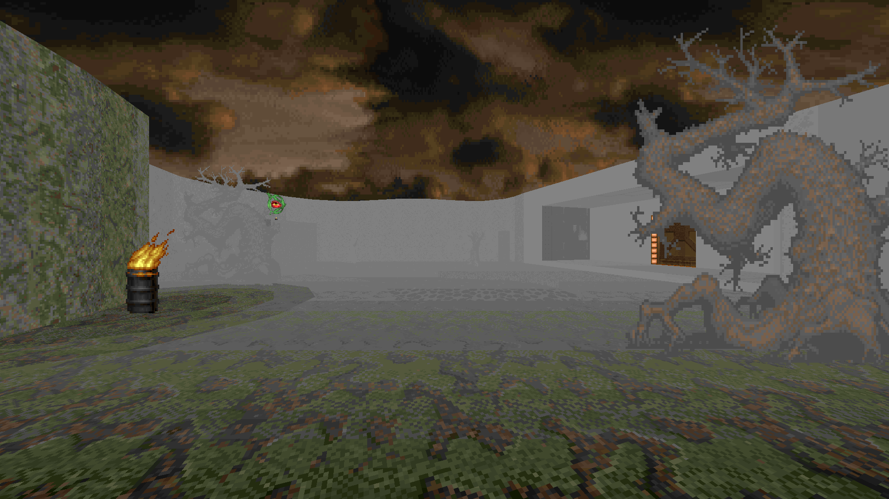
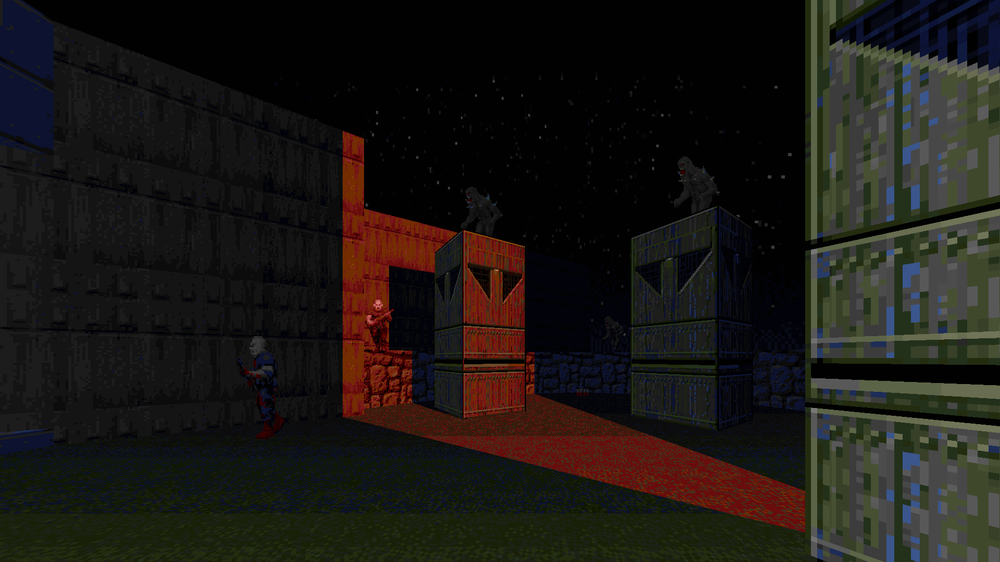

# Big COLORMAP pack for Eternity Engine by DRON12261

# STATUS: ✅RELEASED

There are 56 colormaps for smooth gradient color lighting (total of 7 colors in 8 degrees of color overlay), there are 30 colormaps for fog in different colors, and 4 additional colormaps for noir or contrasting black and white.

To apply a colormap in Eternity Engine UDMF to a particular sector, you must open the custom properties of that sector and type the name of the desired colormap in the colormapmid field.

The degree of fog in a sector depends on the brightness of the sector - the darker the sector, the stronger the fog is.

To prevent colored lighting from being applied to the sky, a skybox must be used.

PLAYPAL and basic COLORMAP from Vanilla+ mod by WorldMachine, but it applies to vanilla colormap too, it just looks better with this.

### Download - [Latest Release - v1](https://github.com/dron12261games/MOD-VanillaPSX/releases/download/v5/VanillaPSX.V5.by.DRON12261.WAD)

# COLORMAPs List:
### Pure colors _(from 1 to 8, 1 - less intense, 8 - more intense)_
| Description  | First    | Last     |
|--------------|----------|----------|
| Green color  | GREN**1**MAP | GREN**8**MAP |
| Red color    | RED**1**MAP  | RED**8**MAP  |
| Blue color   | BLUE**1**MAP | BLUE**8**MAP |
| Yellow color | YELL**1**MAP | YELL**8**MAP |
| Orange color | ORNG**1**MAP | ORNG**8**MAP |
| Brown color  | BRWN**1**MAP | BRWN**8**MAP |
| Gray color   | GRAY**1**MAP | GRAY**8**MAP |

### Fogs
| Description         | COLORMAP |
|---------------------|----------|
| White fog           | FWHTEMAP |
| Light gray fog      | FLGRAMAP |
| Dark gray fog       | FDGRAMAP |
| Black fog           | FBLCKMAP |
| ---                 | ---      |
| Light green fog     | FLGRNMAP |
| Medium green fog    | FMGRNMAP |
| Dark green fog      | FDGRNMAP |
| ---                 | ---      |
| Light yellow fog    | FLYELMAP |
| Dark yellow fog     | FDYELMAP |
| Light orange fog    | FLORGMAP |
| Medium orange fog   | FMORGMAP |
| Dark orange fog     | FDORGMAP |
| ---                 | ---      |
| Light red fog       | FLREDMAP |
| Medium red fog      | FMREDMAP |
| Dark red fog        | FDREDMAP |
| Light alt red fog   | FLR3DMAP |
| Medium alt red fog  | FMR3DMAP |
| Dark alt red fog    | FDR3DMAP |
| ---                 | ---      |
| Light blue fog      | FLBLUMAP |
| Medium blue fog     | FMBLUMAP |
| Dark blue fog       | FDBLUMAP |
| ---                 | ---      |
| Light brown fog     | FLBRNMAP |
| Medium brown fog    | FMBRNMAP |
| Dark brown fog      | FDBRNMAP |
| ---                 | ---      |
| Light dirt fog      | FLDRTMAP |
| Medium dirt fog     | FMDRTMAP |
| Dark dirt fog       | FDDRTMAP |
| Green dirt fog      | FGDRTMAP |
| Dark green dirt fog | FNDRTMAP |
| ---                 | ---      |
| Purple fog          | FPURPMAP |

### Other
| Description   | COLORMAP |
|---------------|----------|
| Noir          | NOIR1MAP |
| Contrast noir | NOIR2MAP |
| Black         | BLACKMAP |
| Darker Black  | CONTRMAP |

# Credits:
90 special COLORMAPs created by DRON12261

PLAYPAL and basic COLORMAP from Vanilla+ mod by WorldMachine

# Screenshots:

